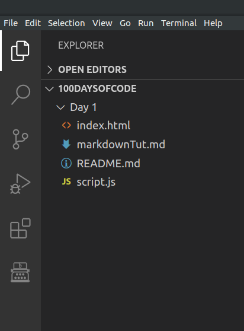
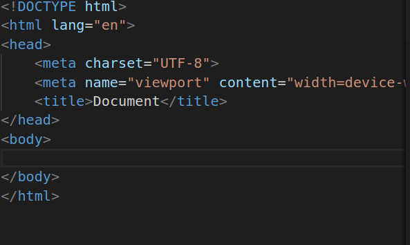
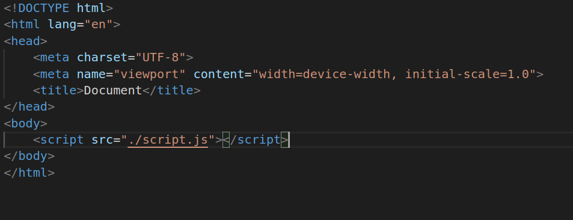

#### Day 1 of 100DaysOfCodeChallenge

__What is JavaScript__ : 
As the ususal definition goes by, JavaScript is high-level, often just-in-time compiled, and multi-paradigm programming language. It has curly-bracket syntax, dynamic typing, prototype-based object-orientation, and first-class functions. 

There are several usage of JavaScript. Some of it's application includes Creation of Front End, Back-end, desktop and Mobile apps. Websites like Spotify, facebook and instagram are built using JavaScript.


__JavaScript Engines__ :
 Main functionality of JavaScript engine is to provide a compiler for JavaScript code without needing to attach it with a browser. In simple words, we can also run JavaScript in our terminal or VSCode editor independently without the help of browser or a HTML file. For example, Node helps us in doing that. Some popular JS engines used by different browsers are :
1. V8 from Google which is  used by browsers like Google Chrome as well as Chromium.

2. SpiderMonkey is developed by Mozilla and used in Firefox browser.

3. JavaScriptCore is developed by Apple and used by it's safari browser.

4. Chakra is JS engine of Internet Explorer broswer.


__ECMAscript__ :
At the beginning of any Web Development class, we are provided with a diagram illustarting the relationship between HTML, CSS and JavaScript. 
Any person with basic knowledge in computer science will say that HTML provides the structure of the web page. CSS is used for styling and JavaScript is used for enhancing the webpage. 

But Javascript is capable of doing way lot of things like DOM manipulation than just enhancing a web page. 

ECMAscript widely known as ES is a general purpose programming language and it also acts as a standard for languages like JavaScript, ActionScript, Nashorn etc. 

To describe it in a easier way, ECMAscript is a set of guidelines that JavaScript follow entirely to implement it's various functionalities in terms of programs or codes. JavaScript is built on top of ECMAscript. 

There are several versions of ECMAscript but most widely used version is ES6 which provided several features like arrows, classes, enhanced object literals, template strings, destruting, generators, unicode, modules and so on. The list along with the code for implementation is provided in the link : https://github.com/lukehoban/es6features#promises


**Step to Write Your First JavaScript Code in VSCode Editor:**
1. Create a directory called Day 1. Inside the Day 1 directory, create two files : index.html and script.js. 

    

2. We don't have to write the entire HTML code because pressing !(exclamation) on the keyboard will provide us with the entire HTML document.
    
3. Then we need to include the path of our script.js file inside the body of the HTML document. We do so instead of providing it in the head because after loading the head and everything, JS file will load at the end. 
            format : ``` JavaScript
             <script src="./script.js"></script>
             ```
    
Here the ./ will provide the relative path or the path of current directory in which the file is present. Also it will provide options of other files present in the current directory.
            
